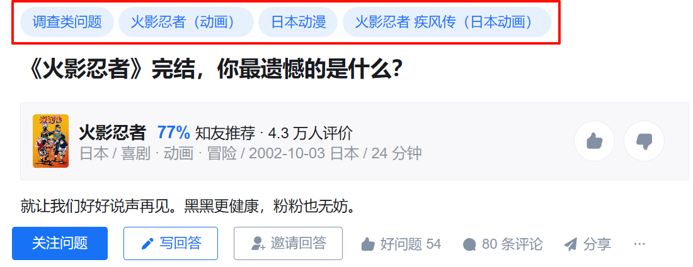

# ZhihuTopicCrawler
一个知乎话题、问题、用户信息的爬虫

## **项目简介**

> 2024/11/16 代码可用
> 
> 此知乎爬虫仅用于学习和研究目的。在未经知乎许可的情况下，请勿将其用于商业用途或大规模数据抓取，否则可能会违反知乎的使用条款和法律法规。
> 
> 本项目从前人的爬虫代码出发，在此基础上做了大量修改，使之适用于目前的知乎API，并添加了数据更新功能，从而实现对某一话题的数据追踪。他们是[机灵鹤 (Smart Crane)](https://smartcrane.tech/)、[Di Zhou](https://di-zhou.github.io/)，感谢两位老师。
> 
> 在使用中若遇到任何问题欢迎以任何形式反馈，但作者能力很有限，反馈了也不一定能解决😇。

一个社科小萌新编写的知乎话题爬虫，它能：

1. 根据知乎话题 ID 爬取该话题标签下的**大部分**问题和专栏，支持多个话题爬取[为什么不是全部问题](https://github.com/tianranchunzhen/ZhihuTopicCrawler#scraping1_questions_by_topicidpy)
2. 根据问题列表爬取问题的元信息
3. 根据问题 ID 爬取该问题下所有的答案及答案对应的作者信息
4. 根据用户主页 URL 爬取用户元信息
5. 2024/12/01更新：根据问题 ID 和答案 ID 爬取对应评论区内容（一次只能抓取一个问题）

## **代码说明**

### **get_url_text.py**

包含访问网页并返回网页文本的函数，用于在其他部分中调用。使用前需登录自己的知乎账号更新其中的 `headers`部分，网页出现乱码时也需在此处更新 Cookie。

### **scraping1_questions_by_topicID.py**

这部分代码用于根据知乎话题 ID 爬取该话题标签下的大部分问题和专栏，支持多个话题爬取。

- **Input:** 想要爬取的话题 ID，如 `# 火影忍者`的 ID 为 `19555130`，可从话题页 URL 中找到
- **Output:** 问题/专栏列表 `data/question_list.csv`，其中包含条目类型（问题、来自回答的问题、专栏）、问题/专栏 ID、问题/专栏标题、问题/专栏 URL、创建日期

> [!IMPORTANT]
> 代码会爬取话题页中讨论、精华、等待回答三个版块中所有可获取的条目数据，其中包含大量问题和专栏信息。  
> 但由于知乎修改了话题页面的展示机制，现在各个板块最多只能展示1000条数据，因此获取的条目数据基本无法包含该话题下的全部问题和专栏。特别是对于一些时间跨度大、热度高的话题来说，这一问题更加严重。这是来自知乎服务器端的限制，无法从本地解决。  
> 代码会对讨论、等待回答两个板块分别根据热门排序和时间排序进行爬取，以确保涵盖尽可能多的不重复的问题/专栏信息。您也可以通过爬取多个相似话题标签以最大化您的数据覆盖度。

### **scraping2_question_meta_by_questionID.py**

这部分代码用于根据问题列表爬取问题的元信息。可从问题/专栏列表中读取并筛选出符合条件（如非 “专栏” 类型且在指定日期之后）的问题 ID 列表，并爬取这些问题的元数据。

- **Input:** `scraping1`得到的问题列表 `data/question_list.csv`，可设置筛选条件
- **Output:** 问题元数据文档 `data/question_meta_info.csv`，其中包含问题ID、问题文本、问题关注数、问题浏览数、问题回答数、问题话题标签、问题创建时间。

> [!IMPORTANT]
> 知乎引入了反爬虫机制，在检测到爬虫时会将返回的文本加密为乱码，加密来自服务器端且采用动态加密算法，无法从本地解决。（也许使用代理池等技术可以解决，但菜鸡不会😇）  
> 在运行脚本过程中，之前存在爬取 250 条问题数据后出现乱码的情况，此时需要手动到浏览器中删除 Cookie、重新登录、重新填写更新后的 Cookie。  
> 但 2024/11/16 运行时似乎没有出现该问题。不过仍建议在使用过程中留意相关情况，如有异常可根据实际情况进行调整或排查。

乱码画面：

### **scraping3_answer_meta_by_questionID.py**

核心代码，用于根据问题 ID 爬取该问题下所有的答案及答案对应的作者信息。

- **Input:** `scraping2`得到的问题元数据文档 `data/question_meta_info.csv`，可设置筛选条件
- **Output:** 对于每个问题，都会输出一个对应的 CSV 文件，默认为 `data/answers_of_question/question_{QID}.csv`，其中包含答案 ID、答案文本、创作日期、赞同数、评论数、作者昵称、作者性别、作者主页URL、作者粉丝数、作者简介。

> [!IMPORTANT]
>
> 1. 爬一段时间会触发知乎的验证码机制导致 HTTPError 报错，需要手动重新设置开始位置，将输出中报错的问题序号更新到 `begin_index` 即可；有时会发生原因未止的报错，重新运行即可；  
> 2. 对于回答数很多的问题，报错时可在标记位置添加中途 URL，方便断点续爬。若在其中添加 URL，则需要将`q_list`索引设置为`q_list[begin_index:begin_index+1]`，并在该问题爬取完毕后删除断点 URL；  
> 3. 输出中包含文本片段，建议随时观察是否出现乱码；  
> 4. 可用来更新问题回答，若存在问题对应的文件则首先尝试按时间顺序爬取最新回答，并与之前数据合并；  
> 5. 因为4.，若按时间排序更新数据时发生报错，则需要删除该问题的对应的 CSV 文件并重新爬取，否则会导致数据不完整。  
> 6. 为什么这么多注意，因为作者太菜了😭

### **scraping4_comments_by_answerID.py**

这部分代码用于根据问题 ID 爬取对应评论区内容，需要先运行`scraping3`获取该问题的所有答案。可以获取所有根评论和子评论，以及所回应的目标评论和所回应的根评论，以及所有评论的作者信息，从而可以还原完整的评论区回复关系。

- **Input:** 一个问题 ID
- **Output:** 对于每个问题，都会输出一个对应的 CSV 文件，默认为 `data/comments_of_question/question_{QID}.csv`，其中包含答案 ID、评论 ID、评论内容、评论关系、评论作者信息等。

> [!IMPORTANT]
> 注意：爬一段时间会触发知乎的验证码机制，因此强烈推荐一次只设置一个问题进行爬取。可以通过多次运行以爬取想要的多个问题评论区。

### **scraping4.5_data_processing.py**

这部分代码用于将 `scraping3`生成的所有问题的 CSV 文件合并为一个 CSV 文件 `all_answers.csv`，并获取生成不重复的用户清单 `data/user_tokens.csv`，用于在 `scraping4`中爬取用户信息。

> [!IMPORTANT]
> 注意：即使知乎乱码也不会影响此处获取用户信息，但大概爬取 1000 ~ 2000 条用户信息后会提示需要填写手动填写验证码并重新运行。

> 简单修改即可对`scraping4`所获取的评论区数据进行合并、获取评论区用户清单。

### **scraping5_author_meta_by_authorID.py**

这部分代码用于根据用户主页 URL 爬取用户元信息，包括用户昵称、性别、IP 属地、总赞同数、总喜欢数、粉丝数、总创作数、认证信息与优秀答主徽章。会自动根据全部用户清单和已爬取用户数据获取待获取的用户列表。

- **Input:** `scraping4.5`得到的用户清单 `data/user_tokens.csv`
- **Output:** 用户元数据文档 `data/author_meta_info.csv`，其中包含用户昵称、性别、IP 属地、总赞同数、总喜欢数、粉丝数、总创作数、是否拥有认证信息或优秀答主徽章。

> [!IMPORTANT]
> 注意：即使知乎乱码也不会影响此处获取用户信息，但大概爬取 1000 ~ 2000 条用户信息后会提示需要填写手动填写验证码并重新运行。

